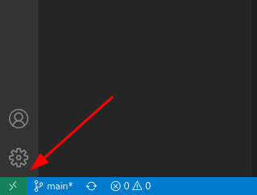
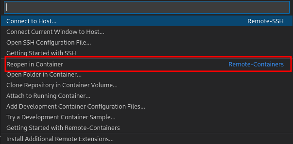

# Computer sync

## Codespace vscode

- Install extension "Remote Development"

```
ms-vscode-remote.vscode-remote-extensionpack
```
- Open folder in vscode
- Click on the icon



- Click on "Reopen in container"



## Run Dev
```bash
flutter pub get
flutter run -d linux
```

## Build end exec

```bash
flutter build linux --release
ldd build/linux/x64/release/bundle/computer_sync
build/linux/x64/release/bundle/computer_sync
```
